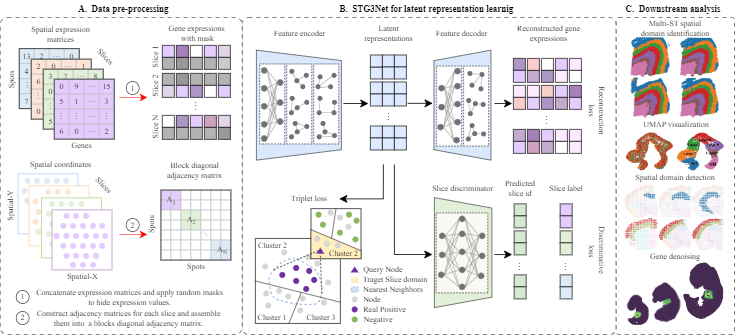

# Multi-Slice Spatial Transcriptomics Data Integration Analysis with STG3Net
## Introduction
In this study, we propose **STG3Net**, a deep learning framework for **multi-slice spatial domain identification and batch correction**. It utilizes a **masked graph autoencoder** as a self-supervised backbone, learning latent representations by reconstructing the expressions of masked spots to mitigate the occurrence of discrete spots. By employing generative **adversarial learning**, the model’s spatial domain identification capabilities are effectively enhanced, particularly in complex, multiple SRT datasets. Additionally, we develop **a plug-and-play batch correction method called Global Nearest Neighbor (G2N)**, specifically designed for SRT datasets. Leveraging global semantic information, G2N captures a more comprehensive set of anchor nodes within the latent space.

## Data
- All public datasets used in this paper are available at [Zenodo](https://zenodo.org/records/12737170)

## Setup
-   `pip install -r requirement.txt`

## Get Started
We provided codes for reproducing the experiments of the paper "Multi-Slice Spatial Transcriptomics Data Integration Analysis with STG3Net", and comprehensive tutorials for using STG3Net.
- Please see `Tutorial`.

